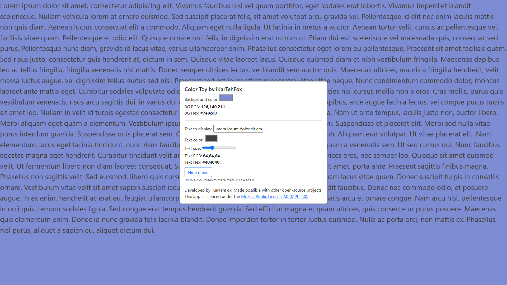

# Color Toy by iKarTehFox
> **A color playground for testing background and text color visibility!**

**Website:** [View in your browser!](https://color-toy.pages.dev)

## Build/run Instructions
Color Toy by iKarTehFox is bundled with Webpack. Follow the instructions below to get started with building the project.

#### Prerequisites
 - [Node.js](https://nodejs.org/)
 - Basic CLI knowledge

#### Instructions
1. Clone the repository and `cd` into it.
```bash
git clone https://github.com/iKarTehFox/color-toy.git && cd color-toy
```
2. Install dependencies: `npm install`

3. Run `npm run build` or `npm run build:prod` to bundle with Webpack in production mode.
   - Bundled files will be located in the `./dist` directory.
   - You can instead run `npm run build:dev` to bundle for development.

4. Serve the files in the `./dist` directory with your favorite http server.

## Features
- Set a custom background color
- Type any text to display in front of the background color
- Choose a custom text color
- Change the text sizing
- Hide the menu with a click of a button (and make it reappear like magic!)

## Gallery


# Acknowledgements (OSS)
- **Bootstrap** ([Link](https://getbootstrap.com/)): Licensed under MIT License

- **hex-rgb** ([GitHub](https://github.com/sindresorhus/hex-rgb)): Licensed under MIT License
 
- **Material Design Icons by Pictogrammers** ([GitHub](https://github.com/Templarian/MaterialDesign)): Licensed under Apache License 2.0

- **Webpack** ([GitHub](https://github.com/webpack/webpack)): Licensed under MIT License

Each license can be found in the code's respective files or website.